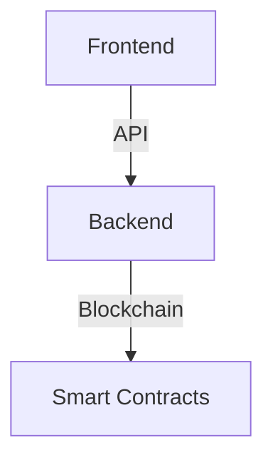

# 📚 Auto-Linkid Documentation

Official documentation for **Auto-Linkid** - An AI-powered LinkedIn content generator with blockchain-based payments.

[](https://docusaurus.io/)
[](https://opensource.org/licenses/MIT)

## 🌟 About

This documentation site provides comprehensive guides, API references, and tutorials for Auto-Linkid platform. Built with [Docusaurus 3](https://docusaurus.io/), it offers:

- 📖 Complete documentation for all components
- 🚀 Quick start guides
- 🔌 API reference
- 📜 Smart contract documentation
- 🎓 Step-by-step tutorials
- 🌍 Multi-language support (EN/ID)

## 🏃‍♂️ Quick Start

### Installation

```bash
# Clone the repository
git clone https://github.com/Auto-Linkid/docs.git
cd docs

# Install dependencies
npm install

# Start development server
npm start
```

The site will open at `http://localhost:3000`.

### Build for Production

```bash
npm run build
```

This generates static content into the `build` directory for deployment.

### Serve Production Build Locally

```bash
npm run serve
```

## 📁 Project Structure

```
auto-linkid-docs/
├── docs/                          # Documentation content
│   ├── intro.md                   # Introduction page
│   ├── guides/                    # Getting started guides
│   ├── architecture/              # System architecture
│   ├── frontend/                  # Frontend documentation
│   ├── backend/                   # Backend documentation
│   ├── smart-contracts/           # Smart contract docs
│   ├── api/                       # API reference
│   ├── payment/                   # Payment system
│   ├── features/                  # Feature guides
│   ├── tutorials/                 # Step-by-step tutorials
│   ├── advanced/                  # Advanced topics
│   ├── security/                  # Security best practices
│   ├── faq.md                     # FAQ
│   ├── changelog.md               # Version history
│   └── contributing.md            # Contribution guide
├── blog/                          # Blog posts
├── src/
│   ├── components/                # React components
│   ├── css/
│   │   └── custom.css            # Custom styling
│   └── pages/
│       ├── index.tsx             # Homepage
│       └── index.module.css      # Homepage styles
├── static/
│   ├── img/                      # Images and assets
│   └── assets/                   # Additional assets
├── docusaurus.config.ts          # Docusaurus configuration
├── sidebars.ts                   # Sidebar navigation
├── package.json                  # Dependencies
└── README.md                     # This file
```

## 🎨 Features

### Content Features

- ✅ **Comprehensive Documentation** - Covers all aspects of Auto-Linkid
- ✅ **Code Examples** - Syntax highlighting for multiple languages
- ✅ **Diagrams** - Mermaid.js for flowcharts and architecture diagrams
- ✅ **Search** - Algolia DocSearch integration (coming soon)
- ✅ **Versioning** - Documentation versioning support
- ✅ **Multi-language** - English and Bahasa Indonesia

### Technical Features

- ⚡ **Fast** - Built with React and optimized for performance
- 🎨 **Beautiful** - Modern, clean design inspired by top docs sites
- 📱 **Responsive** - Mobile-first design
- 🌙 **Dark Mode** - Automatic theme switching
- 🔍 **SEO Optimized** - Meta tags and structured data
- 📊 **Analytics Ready** - Google Analytics integration

## 📝 Writing Documentation

### Creating a New Page

1. Create a new `.md` or `.mdx` file in the `docs/` directory
2. Add frontmatter:

```markdown
---
sidebar_position: 1
title: My New Page
---

# My New Page

Content goes here...
```

3. The page will automatically appear in the sidebar

### Using Admonitions

```markdown
:::tip
This is a helpful tip!
:::

:::warning
Be careful with this!
:::

:::danger
This is dangerous!
:::

:::info
Just FYI...
:::
```

### Adding Code Blocks

````markdown
```typescript title="example.ts"
const greeting: string = "Hello, World!";
console.log(greeting);
```
````

### Creating Diagrams

````markdown

````

## 🌍 Multi-language Support

### Adding a Translation

1. Run the write translations command:

```bash
npm run write-translations -- --locale id
```

2. Translate files in `i18n/id/docusaurus-plugin-content-docs/current/`

3. Build with locale:

```bash
npm run build -- --locale id
```

## 🚀 Deployment

### Deploy to GitHub Pages

```bash
npm run deploy
```

### Deploy to Vercel

1. Import repository to Vercel
2. Set build command: `npm run build`
3. Set output directory: `build`
4. Deploy!

### Deploy to Netlify

1. Connect repository
2. Build command: `npm run build`
3. Publish directory: `build`
4. Deploy!

## 🎨 Customization

### Styling

Edit `src/css/custom.css` to customize:

- Colors and themes
- Typography
- Component styles
- Custom animations

### Configuration

Edit `docusaurus.config.ts` to configure:

- Site metadata
- Navigation
- Footer
- Plugins
- Theme options

## 📊 Analytics

To add Google Analytics:

```typescript
// In docusaurus.config.ts
gtag: {
  trackingID: 'G-XXXXXXXXXX',
  anonymizeIP: true,
},
```

## 🤝 Contributing

We welcome contributions! Please see our [Contributing Guide](docs/contributing.md).

### Contribution Process

1. Fork the repository
2. Create a feature branch
3. Make your changes
4. Test locally
5. Submit a pull request

### Guidelines

- Follow existing documentation style
- Use clear, concise language
- Include code examples
- Add screenshots where helpful
- Test all links

## 📄 License

This documentation is licensed under the MIT License.

## 🔗 Links

- **Main Repository:** [github.com/Auto-Linkid](https://github.com/Auto-Linkid)
- **Frontend:** [github.com/Auto-Linkid/Frontend](https://github.com/Auto-Linkid/Frontend)
- **Backend:** [github.com/Auto-Linkid/AI-Backend](https://github.com/Auto-Linkid/AI-Backend)
- **Smart Contracts:** [github.com/Auto-Linkid/SmartContract](https://github.com/Auto-Linkid/SmartContract)
- **Discord:** [discord.gg/auto-linkid](https://discord.gg/auto-linkid)
- **Twitter:** [@auto_linkid](https://twitter.com/auto_linkid)

## 🙏 Acknowledgments

- Built with [Docusaurus](https://docusaurus.io/)
- Inspired by [OWNAFarm Docs](https://yeheskieltame.gitbook.io/ownafarm)
- Icons from [Emoji](https://emojipedia.org/)
- Diagrams with [Mermaid](https://mermaid.js.org/)

## 📧 Support

- 📖 **Documentation:** You're here!
- 💬 **Discord:** [Join our community](https://discord.gg/auto-linkid)
- 🐛 **Issues:** [GitHub Issues](https://github.com/Auto-Linkid/docs/issues)
- 📧 **Email:** support@auto-linkid.com

---

**Made with ❤️ by the Auto-Linkid Team**
