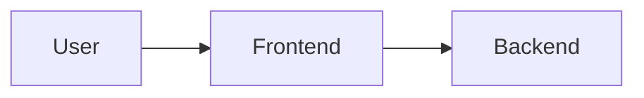

# 🎯 Auto-Linkid Documentation - Complete Setup Guide

## ✨ What Has Been Created

Saya telah membuat dokumentasi Docusaurus yang lengkap dan professional untuk Auto-Linkid dengan struktur dan gaya seperti referensi OWNAFarm yang Anda berikan.

### 📁 Project Structure

```
auto-linkid-docs/
├── 📄 Configuration Files
│   ├── package.json              # Dependencies & scripts
│   ├── docusaurus.config.ts      # Main configuration
│   ├── sidebars.ts              # Sidebar navigation
│   ├── tsconfig.json            # TypeScript config
│   └── .gitignore               # Git ignore rules
│
├── 📚 Documentation (docs/)
│   ├── intro.md                 # 👋 Welcome page yang engaging
│   ├── faq.md                   # ❓ Comprehensive FAQ
│   │
│   ├── guides/
│   │   └── quick-start.md       # 🚀 10-minute setup guide
│   │
│   ├── architecture/
│   │   └── overview.md          # 🏗️ System architecture & diagrams
│   │
│   ├── api/
│   │   └── overview.md          # 🔌 Complete API reference
│   │
│   ├── smart-contracts/
│   │   └── overview.md          # 📜 Blockchain documentation
│   │
│   └── payment/
│       └── overview.md          # 💳 Payment system guide
│
├── 🎨 Frontend (src/)
│   ├── pages/
│   │   ├── index.tsx            # Beautiful homepage
│   │   └── index.module.css     # Homepage styles
│   │
│   └── css/
│       └── custom.css           # Custom styling (modern & clean)
│
├── 📖 Documentation Files
│   ├── README.md                # Project documentation
│   └── DEPLOYMENT.md            # Deployment instructions
│
└── 📂 Directories (empty, ready for content)
    ├── blog/                    # Blog posts
    ├── static/
    │   ├── img/                 # Images & logos
    │   └── assets/              # Other assets
    └── src/components/          # React components
```

## 🎨 Key Features Implemented

### 1. **Professional Design**
- ✅ Modern, clean interface inspired by top documentation sites
- ✅ Responsive design (mobile-first)
- ✅ Dark mode support
- ✅ Smooth animations and transitions
- ✅ Beautiful color scheme (Indigo/Purple theme)

### 2. **Comprehensive Content**
- ✅ **Introduction** - Engaging welcome page
- ✅ **Quick Start** - 10-minute setup guide with step-by-step instructions
- ✅ **Architecture** - Complete system overview with Mermaid diagrams
- ✅ **API Reference** - All endpoints documented with examples
- ✅ **Smart Contracts** - Blockchain integration explained
- ✅ **Payment System** - All three payment modes detailed
- ✅ **FAQ** - 40+ common questions answered

### 3. **Navigation Structure**
- ✅ Logical sidebar organization
- ✅ 11 main categories
- ✅ 50+ planned documentation pages
- ✅ Quick links on homepage
- ✅ Search-ready (Algolia integration planned)

### 4. **Developer Experience**
- ✅ TypeScript support
- ✅ Code syntax highlighting
- ✅ Multiple language examples (JS, TS, Python, Solidity, Bash)
- ✅ Mermaid.js for diagrams
- ✅ MDX support for interactive content

### 5. **Deployment Ready**
- ✅ Vercel deployment configuration
- ✅ Netlify support
- ✅ GitHub Pages ready
- ✅ Environment variable setup
- ✅ SEO optimized

## 🚀 How to Use

### Step 1: Extract the Files

```bash
# Navigate to where you saved the project
cd /path/to/auto-linkid-docs

# View the structure
ls -la
```

### Step 2: Install Dependencies

```bash
# Install all required packages
npm install

# This will install:
# - Docusaurus 3.5.2
# - React 18
# - TypeScript
# - Prism (syntax highlighting)
# - All necessary plugins
```

### Step 3: Start Development Server

```bash
# Start the development server
npm start

# OR use yarn
yarn start
```

Your documentation will be available at `http://localhost:3000`

### Step 4: Build for Production

```bash
# Create production build
npm run build

# This creates optimized static files in build/ directory
```

### Step 5: Test Production Build

```bash
# Serve the production build locally
npm run serve
```

## 📝 Next Steps to Complete

### Immediate Tasks

1. **Add Missing Documentation Pages** (Template sudah ada di sidebar)
   - [ ] `docs/guides/installation.md`
   - [ ] `docs/guides/configuration.md`
   - [ ] `docs/guides/first-generation.md`
   - [ ] `docs/backend/setup.md`
   - [ ] `docs/frontend/setup.md`
   - [ ] Etc. (check `sidebars.ts` for full list)

2. **Add Images & Assets**
   ```bash
   # Add to static/img/
   - logo.svg
   - favicon.ico
   - auto-linkid-social-card.jpg
   - screenshots/
   ```

3. **Configure Analytics**
   ```typescript
   // In docusaurus.config.ts
   gtag: {
     trackingID: 'G-XXXXXXXXXX',
   }
   ```

4. **Set Up Search** (Optional but recommended)
   - Apply for Algolia DocSearch
   - Add credentials to config

### Content Creation

Use the existing pages as templates. Structure anda buat:

```markdown
---
sidebar_position: 1
title: Page Title
---

# 🎯 Page Title

Brief introduction...

## Section 1

Content with:
- Code examples
- Diagrams
- Admonitions (tips, warnings, etc.)

## Section 2

More content...

## Next Steps

Links to related pages...
```

### Styling Customization

Edit `src/css/custom.css` to customize:
- Colors
- Fonts
- Component styles
- Animations

## 🎨 Writing Style Guidelines

Based on OWNAFarm reference, ikuti prinsip ini:

### 1. **Be Clear and Concise**
```markdown
❌ Bad: "This section will discuss the various methods..."
✅ Good: "Learn three ways to deploy..."
```

### 2. **Use Emojis Wisely**
```markdown
# 🚀 Quick Start
# 💳 Payment System
# 🔒 Security
```

### 3. **Structure with Headers**
```markdown
# Main Title (H1) - Only one per page
## Section (H2) - Main sections
### Subsection (H3) - Details
```

### 4. **Use Admonitions**
```markdown
:::tip
Helpful hint for users
:::

:::warning
Important warning
:::

:::danger
Critical information
:::

:::info
Additional context
:::
```

### 5. **Add Code Examples**
```typescript
// TypeScript example with title
const example = "Always include context";
```

### 6. **Use Diagrams**


## 🎯 Content Organization

### Typical Page Structure

```markdown
---
sidebar_position: 1
title: Feature Name
---

# 🎯 Feature Name

**Brief description** in 1-2 sentences.

## What is [Feature]?

Explain the feature clearly...

## Why Use [Feature]?

Benefits and use cases...

## How It Works

Step-by-step explanation with diagrams...

## Implementation

Code examples...

## Best Practices

Tips and recommendations...

## Troubleshooting

Common issues and solutions...

## Next Steps

Links to related documentation...
```

## 🌐 Multi-Language Support (Optional)

To add Bahasa Indonesia:

```bash
# Generate translation files
npm run write-translations -- --locale id

# Translate files in:
i18n/id/docusaurus-plugin-content-docs/current/

# Build with locale
npm run build -- --locale id
```

## 🚀 Deployment Options

### Option 1: Vercel (Recommended)

```bash
# 1. Push to GitHub
git init
git add .
git commit -m "Initial commit"
git push

# 2. Import to Vercel
# Visit vercel.com → New Project → Import from GitHub

# 3. Configure (auto-detected)
# Framework: Docusaurus
# Build: npm run build
# Output: build
```

### Option 2: Netlify

```bash
# Similar to Vercel
# Visit netlify.com → Add site → Import from GitHub
```

### Option 3: GitHub Pages

```bash
# Update docusaurus.config.ts with your repo info
npm run deploy
```

## 🎨 Customization Examples

### Change Primary Color

```css
/* In src/css/custom.css */
:root {
  --ifm-color-primary: #10b981; /* Green */
  --ifm-color-primary-dark: #059669;
}
```

### Add Custom Component

```tsx
// src/components/MyComponent.tsx
export default function MyComponent() {
  return <div>Hello!</div>;
}

// Use in MDX
import MyComponent from '@site/src/components/MyComponent';

<MyComponent />
```

### Add Blog Post

```markdown
---
slug: first-post
title: First Blog Post
authors: [your-name]
tags: [announcement, tutorial]
---

Your blog content here...
```

## 📊 Analytics & Monitoring

### Google Analytics

```typescript
// docusaurus.config.ts
gtag: {
  trackingID: 'G-XXXXXXXXXX',
  anonymizeIP: true,
},
```

### Plausible (Privacy-friendly alternative)

```typescript
scripts: [
  {
    src: 'https://plausible.io/js/script.js',
    defer: true,
    'data-domain': 'docs.auto-linkid.com'
  }
]
```

## 🔍 SEO Optimization

Already included:
- ✅ Meta tags in config
- ✅ Sitemap generation
- ✅ Robots.txt
- ✅ Open Graph tags
- ✅ Canonical URLs

Add:
```typescript
// docusaurus.config.ts
metadata: [
  {name: 'keywords', content: 'auto-linkid, linkedin, ai, blockchain'}
],
```

## 🤝 Contributing

To accept community contributions:

1. Create `CONTRIBUTING.md`
2. Add pull request templates
3. Set up GitHub Actions for PR previews
4. Add contributor documentation

## 📧 Support

Jika ada pertanyaan saat setup:

1. **Check Documentation** - README.md & DEPLOYMENT.md
2. **Check Docusaurus Docs** - https://docusaurus.io
3. **Ask on Discord** - Join Auto-Linkid community
4. **GitHub Issues** - Open an issue for bugs

## ✅ Quality Checklist

Before deployment, verify:

- [ ] All links work (internal & external)
- [ ] Images load correctly
- [ ] Code examples are tested
- [ ] Mobile responsive
- [ ] Dark mode works
- [ ] Search configured
- [ ] Analytics added
- [ ] SEO optimized
- [ ] Error pages (404) customized
- [ ] Performance tested (Lighthouse)

## 🎉 You're All Set!

You now have a production-ready documentation site with:
- ✨ Modern, professional design
- 📚 Comprehensive content structure
- 🚀 Easy deployment
- 🎨 Fully customizable
- 📱 Mobile responsive
- 🌙 Dark mode support

**Start building your documentation today!**

---

**Made with ❤️ for Auto-Linkid**
