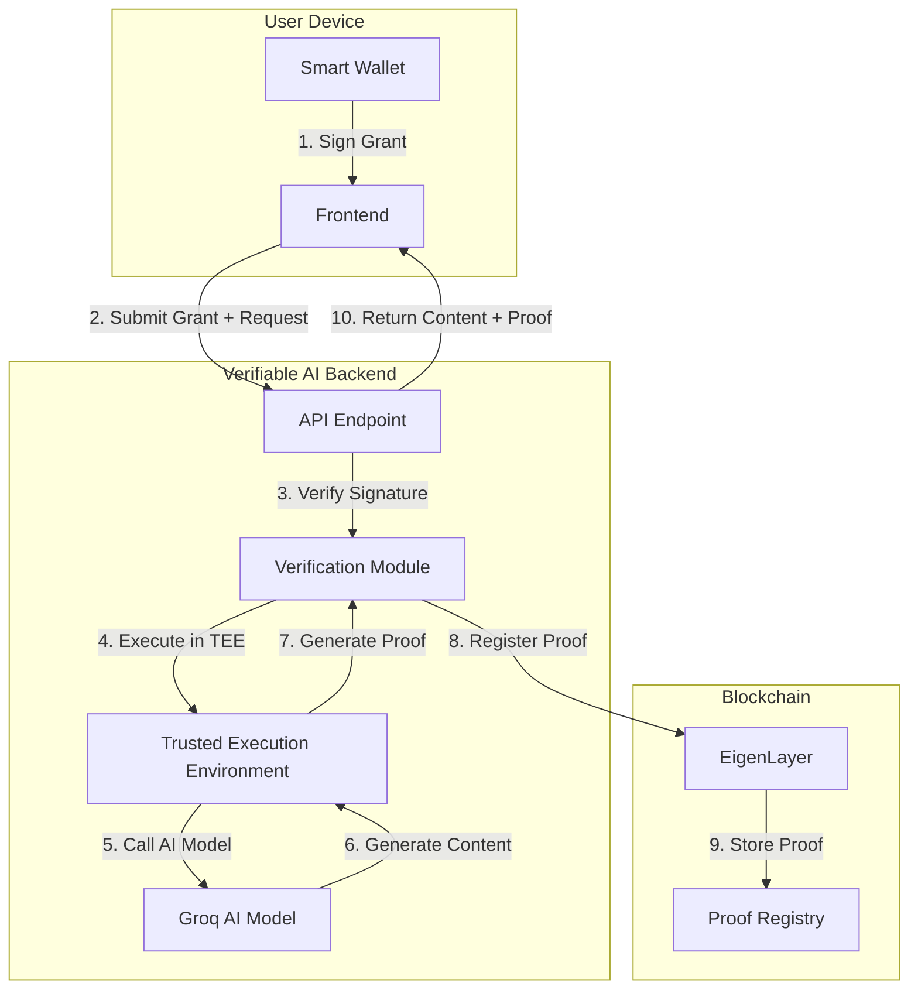
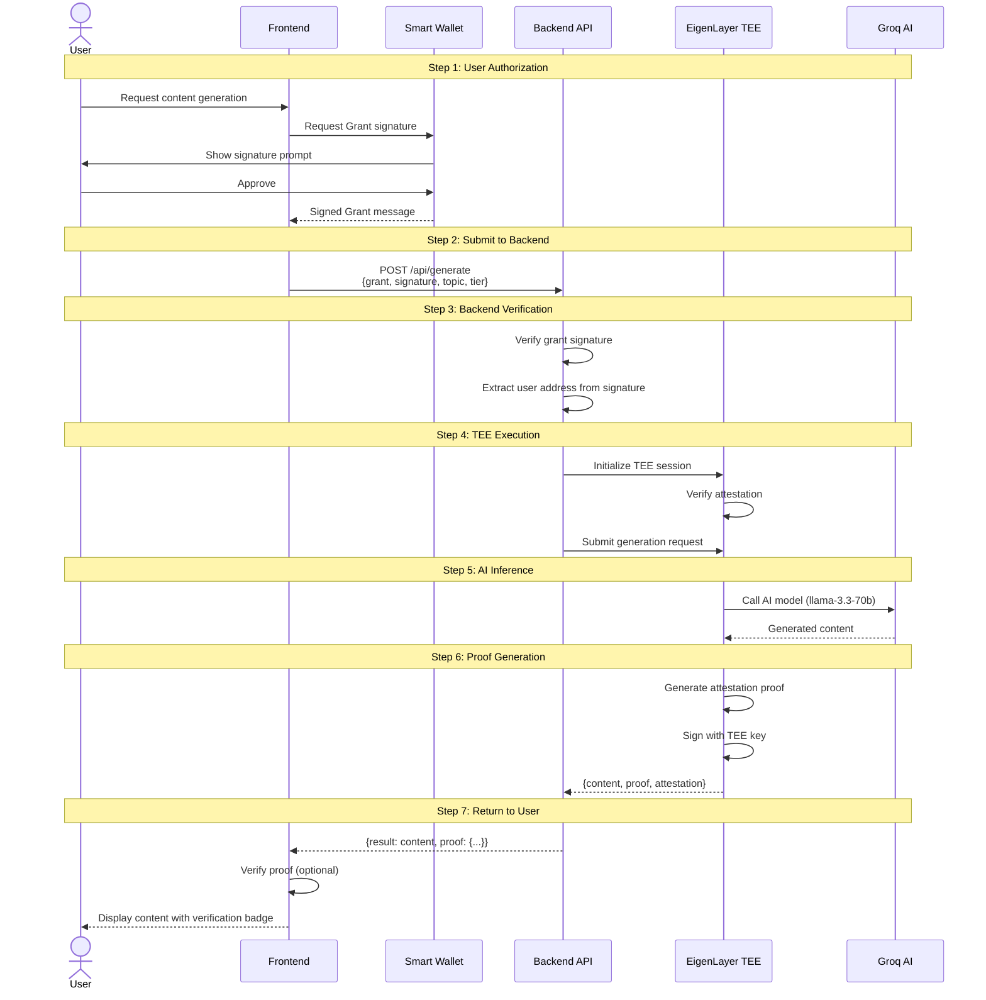
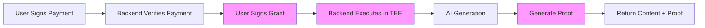

# Verifiable AI Architecture

BasedLink implements cryptographically verifiable AI inference using EigenLayer's Trusted Execution Environment (TEE). This ensures that AI-generated content is authentic and has not been tampered with.

## The Problem with Traditional AI APIs

Traditional AI APIs suffer from several trust issues:

1. **No Proof of Execution**: Users cannot verify which model generated the content
2. **Tampering Risk**: Server operators could manipulate results
3. **Model Uncertainty**: No guarantee the advertised model was actually used
4. **Result Manipulation**: AI outputs could be altered before returning to users

## Verifiable AI Solution

BasedLink solves these problems using EigenLayer's TEE infrastructure:



## How EigenLayer TEE Works

### Trusted Execution Environment

A TEE is a secure area within a processor that:
- **Isolates Execution**: Code runs in a protected environment
- **Prevents Tampering**: Even the OS cannot modify execution
- **Generates Attestations**: Cryptographic proof of what code ran
- **Ensures Privacy**: Input/output data is encrypted

EigenLayer provides a decentralized network of TEE nodes that execute verifiable computation.

### Verification Flow



## Grant Signature Mechanism

### What is a Grant?

A Grant is a cryptographic signature from the user authorizing the backend to execute AI inference on their behalf.

**EIP-712 Grant Structure:**

```typescript
const grantDomain = {
  name: "BasedLink Verifiable AI",
  version: "1",
  chainId: 84532,
};

const grantTypes = {
  Grant: [
    { name: "user", type: "address" },
    { name: "action", type: "string" },
    { name: "timestamp", type: "uint256" },
    { name: "nonce", type: "uint256" },
  ],
};

const grantMessage = {
  user: userAddress,
  action: "GENERATE_CONTENT",
  timestamp: Math.floor(Date.now() / 1000),
  nonce: await getGrantNonce(userAddress),
};
```

### Frontend Implementation

```typescript
import { useSignTypedData } from 'wagmi';

function useEigenGrant() {
  const { signTypedDataAsync } = useSignTypedData();
  
  const requestGrant = async (userAddress: string, action: string) => {
    const timestamp = Math.floor(Date.now() / 1000);
    const nonce = await getGrantNonce(userAddress);
    
    const signature = await signTypedDataAsync({
      domain: grantDomain,
      types: grantTypes,
      primaryType: 'Grant',
      message: {
        user: userAddress,
        action: action,
        timestamp: timestamp,
        nonce: nonce,
      },
    });
    
    return {
      grant: {
        user: userAddress,
        action: action,
        timestamp: timestamp,
        nonce: nonce,
      },
      signature: signature,
    };
  };
  
  return { requestGrant };
}

// Usage
function GenerateButton() {
  const { requestGrant } = useEigenGrant();
  const { address } = useAccount();
  
  const handleGenerate = async () => {
    // Request grant from user
    const { grant, signature } = await requestGrant(
      address,
      'GENERATE_CONTENT'
    );
    
    // Submit to backend with grant
    const response = await fetch('/api/generate', {
      method: 'POST',
      body: JSON.stringify({
        grant,
        signature,
        topic: 'AI in 2025',
        tier: 2,
      }),
    });
    
    const { result, proof } = await response.json();
    
    // Display content with verification
    displayContent(result, proof);
  };
  
  return <button onClick={handleGenerate}>Generate Content</button>;
}
```

## Backend TEE Integration

### Grant Verification

```typescript
import { ethers } from 'ethers';

async function verifyGrant(
  grant: Grant,
  signature: string
): Promise<boolean> {
  // Reconstruct EIP-712 hash
  const domain = {
    name: "BasedLink Verifiable AI",
    version: "1",
    chainId: 84532,
  };
  
  const types = {
    Grant: [
      { name: "user", type: "address" },
      { name: "action", type: "string" },
      { name: "timestamp", type: "uint256" },
      { name: "nonce", type: "uint256" },
    ],
  };
  
  // Verify signature
  const recovered = ethers.verifyTypedData(domain, types, grant, signature);
  
  // Check signature matches claimed user
  if (recovered.toLowerCase() !== grant.user.toLowerCase()) {
    throw new Error('Invalid grant signature');
  }
  
  // Check timestamp (must be recent, e.g. within 5 minutes)
  const now = Math.floor(Date.now() / 1000);
  if (Math.abs(now - grant.timestamp) > 300) {
    throw new Error('Grant expired');
  }
  
  // Verify nonce (prevent replay)
  const isValidNonce = await checkAndIncrementNonce(grant.user, grant.nonce);
  if (!isValidNonce) {
    throw new Error('Invalid nonce');
  }
  
  return true;
}
```

### TEE Execution

```typescript
// Pseudo-code for TEE integration
import { EigenComputeClient } from '@eigenlayer/compute-sdk';

async function executeInTEE(
  grant: Grant,
  topic: string,
  tier: number
): Promise<{ content: string; proof: TEEProof }> {
  // Initialize TEE client
  const teeClient = new EigenComputeClient({
    nodeUrl: EIGEN_NODE_URL,
    privateKey: TEE_OPERATOR_KEY,
  });
  
  // Create TEE session
  const session = await teeClient.createSession({
    code: AI_INFERENCE_CODE_HASH, // Hash of the AI inference code
    inputs: {
      topic: topic,
      tier: tier,
      model: getModelForTier(tier),
    },
  });
  
  // Execute in TEE
  const result = await session.execute();
  
  // Get attestation proof
  const proof = await session.getAttestation();
  
  return {
    content: result.output,
    proof: {
      attestation: proof.attestation,
      signature: proof.signature,
      codeHash: AI_INFERENCE_CODE_HASH,
      timestamp: proof.timestamp,
      nodeAddress: proof.nodeAddress,
    },
  };
}
```

### API Endpoint with Verification

```typescript
// app/api/generate/route.ts
export async function POST(request: Request) {
  const { grant, signature, topic, tier } = await request.json();
  
  // Step 1: Verify grant signature
  await verifyGrant(grant, signature);
  
  // Step 2: Execute in TEE
  const { content, proof } = await executeInTEE(grant, topic, tier);
  
  // Step 3: Register proof on-chain (optional)
  await registerProofOnChain(proof);
  
  // Step 4: Return content with proof
  return Response.json({
    result: content,
    proof: proof,
    verified: true,
  });
}
```

## Proof Structure

### TEE Attestation Proof

```typescript
interface TEEProof {
  // Attestation from TEE hardware
  attestation: string;
  
  // Signature from TEE enclave
  signature: string;
  
  // Hash of the code executed
  codeHash: string;
  
  // Timestamp of execution
  timestamp: number;
  
  // EigenLayer node that executed
  nodeAddress: string;
  
  // Optional: Input hash
  inputHash?: string;
  
  // Optional: Output hash
  outputHash?: string;
}
```

### Frontend Verification (Optional)

```typescript
async function verifyTEEProof(proof: TEEProof): Promise<boolean> {
  // Verify attestation signature
  const isValidSignature = await verifyAttestationSignature(
    proof.attestation,
    proof.signature,
    proof.nodeAddress
  );
  
  if (!isValidSignature) {
    return false;
  }
  
  // Verify node is registered with EigenLayer
  const isRegisteredNode = await checkNodeRegistration(proof.nodeAddress);
  
  if (!isRegisteredNode) {
    return false;
  }
  
  // Verify code hash matches expected
  if (proof.codeHash !== EXPECTED_CODE_HASH) {
    return false;
  }
  
  return true;
}

// Display verification badge
function VerificationBadge({ proof }: { proof: TEEProof }) {
  const [verified, setVerified] = useState(false);
  
  useEffect(() => {
    verifyTEEProof(proof).then(setVerified);
  }, [proof]);
  
  return (
    <div className={verified ? 'verified' : 'unverified'}>
      {verified ? '✓ Verified AI Generation' : 'Verification pending...'}
      <details>
        <summary>Proof Details</summary>
        <pre>{JSON.stringify(proof, null, 2)}</pre>
      </details>
    </div>
  );
}
```

## Security Properties

### What TEE Guarantees

1. **Code Integrity**: The exact code executed is verifiable via code hash
2. **Execution Isolation**: AI inference runs in hardware-protected environment
3. **Tamper Resistance**: Even backend operators cannot modify execution
4. **Attestation**: Cryptographic proof of what code ran with what inputs

### What TEE Does NOT Guarantee

1. **Model Quality**: TEE proves which model ran, not that it is "good"
2. **Input Privacy**: Inputs are visible to TEE operator (can be encrypted)
3. **Output Correctness**: AI outputs are still probabilistic

## Benefits for Users

### Trust

- **Verifiable Model**: Proof that llama-3.3-70b actually generated content
- **No Tampering**: Backend cannot alter AI outputs
- **Audit Trail**: All proofs can be verified independently

### Transparency

- **Open Code**: AI inference code hash is public
- **Public Verification**: Anyone can verify proofs
- **On-chain Registry**: Proofs stored on blockchain

### Future: Decentralized AI

EigenLayer TEE enables:
- **Decentralized Model Hosting**: No single point of control
- **Verifiable Fine-tuning**: Prove model weights and training
- **Composable AI**: Chain verified AI operations

## Integration with X402 Payments

Payment and verification work together:



**Two signatures required:**
1. **Payment Signature** (EIP-712): Authorizes USDC payment
2. **Grant Signature** (EIP-712): Authorizes AI execution

Both are verified before content generation begins.

## Future Enhancements

### On-chain Proof Registry

Store all TEE proofs on-chain for permanent verifiability:

```solidity
contract ProofRegistry {
    struct Proof {
        bytes32 codeHash;
        bytes32 inputHash;
        bytes32 outputHash;
        address nodeOperator;
        uint256 timestamp;
        bytes signature;
    }
    
    mapping(bytes32 => Proof) public proofs;
    
    function registerProof(Proof calldata proof) external {
        bytes32 proofId = keccak256(abi.encode(proof));
        proofs[proofId] = proof;
        emit ProofRegistered(proofId, msg.sender);
    }
}
```

### Privacy-Preserving AI

Use encrypted inputs for sensitive content:

```typescript
// Encrypt input before sending to TEE
const encryptedInput = await encryptWithPublicKey(topic, TEE_PUBLIC_KEY);

// TEE decrypts within enclave
const decrypted = decryptInTEE(encryptedInput, TEE_PRIVATE_KEY);
```

### Multi-Party Verification

Multiple TEE nodes execute the same inference for consensus:

```typescript
const proofs = await Promise.all([
  executeInTEE(node1, input),
  executeInTEE(node2, input),
  executeInTEE(node3, input),
]);

// Verify all nodes produced same output
const isConsensus = proofs.every(p => p.outputHash === proofs[0].outputHash);
```
