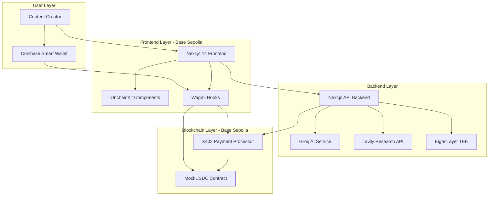
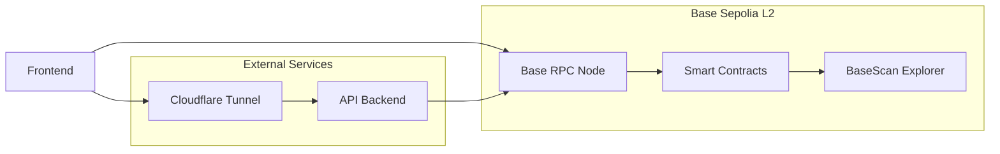
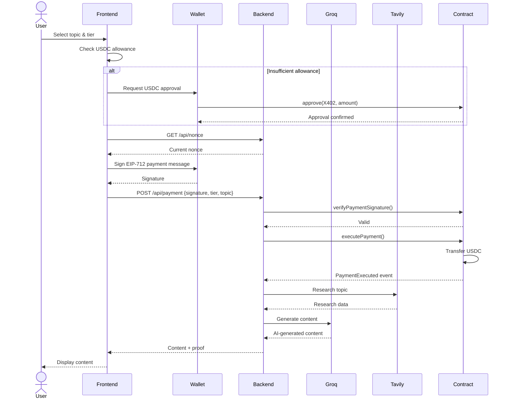
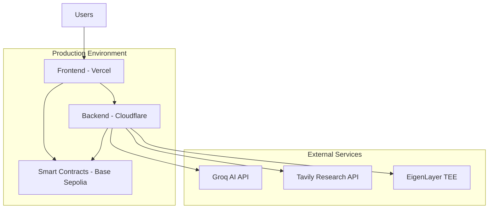

# Architecture Overview

This document provides a comprehensive overview of the BasedLink system architecture, detailing how the Frontend, AI Backend, and Smart Contracts interact to create a seamless, verifiable AI-powered content generation experience.

## System Architecture

BasedLink follows a three-tier architecture pattern with clear separation of concerns:

## Component Responsibilities

### Frontend Application

The Frontend serves as the primary user interface, built with Next.js 14 and OnchainKit:

**Key Responsibilities:**
- User authentication via Coinbase Smart Wallet with Passkeys
- Gamified content creation interface (card-based UI)
- EIP-712 signature generation for payment authorization
- USDC allowance management and approval flows
- Integration with Smart Contracts via Wagmi/Viem
- Display of AI-generated content and verification proofs

**Technology Stack:**
- Next.js 14 (App Router)
- OnchainKit for Web3 components
- Wagmi and Viem for blockchain interactions
- Tailwind CSS v4 for styling
- Framer Motion for animations

### AI Backend Service

The Backend provides AI generation capabilities with verifiable inference:

**Key Responsibilities:**
- Generate LinkedIn content using Groq AI (llama models)
- Conduct real-time research via Tavily API
- Verify payment signatures from Frontend
- Execute payment transactions via Smart Contracts
- Provide cryptographic proofs of AI execution via TEE
- Serve as the payment facilitator in the X402 protocol

**Technology Stack:**
- Next.js 14 (API Routes)
- TypeScript
- Groq SDK (llama-3.3-70b-versatile, llama-3.1-8b-instant)
- Tavily API for web research
- EigenLayer TEE integration
- ethers.js for blockchain interactions

### Smart Contracts

The blockchain layer handles payment processing and verification:

**Key Contracts:**
- **X402PaymentProcessor**: Manages payment execution, nonce tracking, and signature verification
- **MockUSDC**: ERC20 token for testnet payments

**Key Responsibilities:**
- EIP-712 signature verification
- Payment execution with USDC transfers
- Nonce management to prevent replay attacks
- Pricing tier enforcement
- Session payment support
- Event emission for payment tracking

**Technology Stack:**
- Solidity
- Foundry for development and deployment
- Base Sepolia testnet
- OpenZeppelin contracts

## Network Architecture

BasedLink is deployed on the Base Sepolia testnet:

**Network Details:**
- **Chain ID**: 84532
- **Network**: Base Sepolia (L2 Testnet)
- **RPC**: Public Base Sepolia RPC endpoints
- **Explorer**: BaseScan Sepolia

## Data Flow

### Content Generation Flow

## Integration Points

### Frontend to Backend

**Communication Method**: HTTPS REST API

**Endpoints:**
- `GET /api/nonce?user={address}` - Get current nonce for user
- `POST /api/generate` - Generate content without payment (testing)
- `POST /api/payment` - Verify payment and generate content

**Authentication**: EIP-712 signatures

### Frontend to Smart Contracts

**Communication Method**: JSON-RPC via Wagmi/Viem

**Interactions:**
- Read: `getUserNonce()`, `getTierPrice()`, `sessionBalance()`
- Write: `approve()` (MockUSDC), managed through OnchainKit

### Backend to Smart Contracts

**Communication Method**: JSON-RPC via ethers.js

**Interactions:**
- Read: `verifyPaymentSignature()`
- Write: `executePayment()`, `executeSessionPayment()`

## Security Architecture

### Frontend Security

- **Passkey Authentication**: Biometric authentication via Coinbase Smart Wallet
- **Signature Safety**: EIP-712 typed signatures with deadline enforcement
- **Input Validation**: Client-side validation before signature requests
- **No Private Keys**: All key management handled by Smart Wallet

### Backend Security

- **Signature Verification**: All payments verified on-chain before processing
- **Nonce Checking**: Replay attack prevention
- **Deadline Enforcement**: Time-bound signatures
- **TEE Execution**: Verifiable AI inference in Trusted Execution Environment
- **API Rate Limiting**: Protection against abuse

### Smart Contract Security

- **Reentrancy Protection**: Use of checks-effects-interactions pattern
- **Integer Overflow Protection**: Solidity 0.8+ built-in protection
- **Access Control**: Role-based permissions for facilitator
- **Deadline Validation**: Expired signatures rejected
- **Nonce Management**: Monotonically increasing nonces per user

## Scalability Considerations

### Layer 2 Benefits

BasedLink leverages Base Sepolia (L2) for:
- **Low Transaction Fees**: Minimal cost for payment execution
- **Fast Confirmations**: Quick transaction finality
- **Ethereum Security**: Inherits Ethereum L1 security

### Future Optimizations

- **Paymaster Integration**: Gasless transactions for end users
- **Batch Payments**: Session-based payment model for multiple generations
- **Caching Layer**: Redis for nonce and user state caching
- **CDN Distribution**: Frontend served via CDN for global performance

## Deployment Architecture

**Deployment Targets:**
- **Frontend**: Vercel or similar Next.js hosting
- **Backend**: Cloudflare Tunnel with custom domain
- **Smart Contracts**: Base Sepolia testnet (production: Base Mainnet)

## Technology Choices Rationale

### Why Base Sepolia?

- **Low Fees**: Essential for micropayments ($5-$30 range)
- **Fast Finality**: Better user experience
- **Coinbase Integration**: Native support for Coinbase Smart Wallet
- **EVM Compatible**: Standard Solidity development

### Why Coinbase Smart Wallet?

- **No Extensions**: Works in any browser
- **Passkey Auth**: Superior UX with biometrics
- **Gasless Ready**: Supports paymaster for future optimization
- **OnchainKit Integration**: First-class SDK support

### Why Groq AI?

- **Fast Inference**: Rapid content generation
- **Multiple Models**: Choice between quality (70B) and speed (8B)
- **Cost Effective**: Competitive pricing for API calls
- **Reliable**: High uptime and availability

### Why EIP-712 Signatures?

- **User-Friendly**: Readable signature prompts
- **Secure**: Type-safe, domain-separated signatures
- **Standard**: Industry-standard signature method
- **Flexible**: Supports complex data structures
