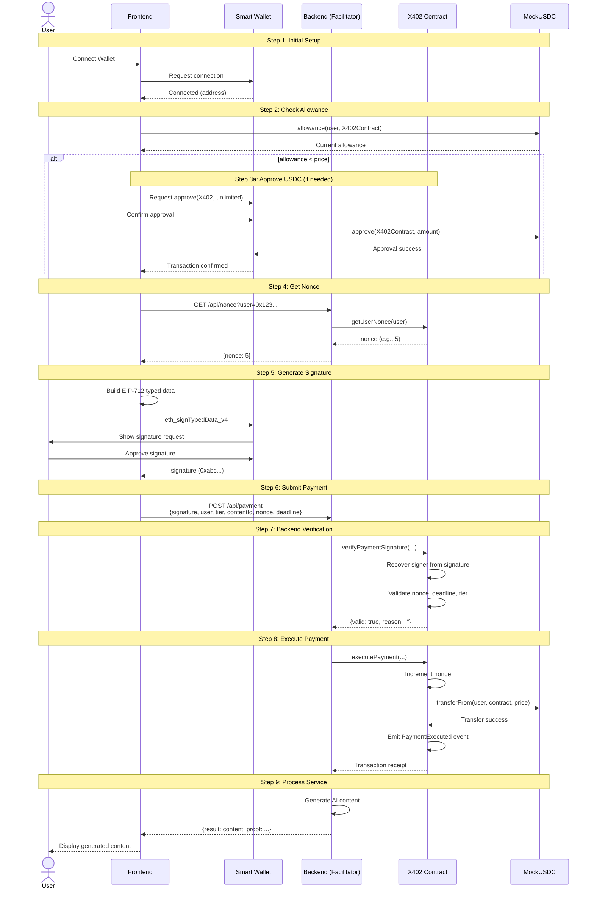

# Payment Flow Architecture

This document details the complete payment flow in BasedLink, from user signature to content generation, using the X402 Payment Protocol.

## X402 Payment Protocol Overview

The X402 Payment Protocol is a blockchain-based payment verification system designed for API monetization. It enables users to authorize payments via cryptographic signatures, which are then executed by a backend facilitator.

**Key Characteristics:**
- **Signature-Based**: Users sign EIP-712 typed messages instead of sending transactions
- **Backend Facilitation**: Backend executes the actual on-chain payment
- **Gasless for Users**: Users only pay for the service, not gas fees
- **Verifiable**: All payments are recorded on-chain with full transparency

## Payment Flow Sequence

### Complete User Journey



## Frontend Responsibilities

### 1. USDC Allowance Management

Before requesting signatures, the Frontend must ensure the user has approved sufficient USDC:

```typescript
import { useReadContract, useWriteContract } from 'wagmi';

function useUSDCAllowance(userAddress: string, spender: string) {
  // Read current allowance
  const { data: allowance } = useReadContract({
    address: USDC_ADDRESS,
    abi: ERC20_ABI,
    functionName: 'allowance',
    args: [userAddress, spender],
  });
  
  // Approve function
  const { writeContract } = useWriteContract();
  
  const approveUSDC = async (amount: bigint) => {
    await writeContract({
      address: USDC_ADDRESS,
      abi: ERC20_ABI,
      functionName: 'approve',
      args: [spender, amount],
    });
  };
  
  return { allowance, approveUSDC };
}
```

**Best Practice**: Request unlimited approval to avoid repeated approval transactions.

### 2. Nonce Retrieval

Fetch the current nonce for the user from the backend:

```typescript
async function getUserNonce(userAddress: string): Promise<number> {
  const response = await fetch(
    `https://api.basedlink.com/api/nonce?user=Rp. {userAddress}`
  );
  const data = await response.json();
  return data.nonce;
}
```

### 3. EIP-712 Signature Generation

Build the typed data structure and request user signature:

```typescript
import { useSignTypedData } from 'wagmi';

const domain = {
  name: "X402PaymentProcessor",
  version: "1",
  chainId: 84532, // Base Sepolia
  verifyingContract: X402_CONTRACT_ADDRESS,
};

const types = {
  PaymentRequest: [
    { name: "user", type: "address" },
    { name: "tier", type: "uint256" },
    { name: "contentId", type: "string" },
    { name: "nonce", type: "uint256" },
    { name: "deadline", type: "uint256" },
  ],
};

function PaymentButton({ tier, contentId }) {
  const { signTypedDataAsync } = useSignTypedData();
  
  const handlePayment = async () => {
    const nonce = await getUserNonce(userAddress);
    const deadline = Math.floor(Date.now() / 1000) + 3600; // 1 hour
    
    const message = {
      user: userAddress,
      tier: tier,
      contentId: contentId,
      nonce: nonce,
      deadline: deadline,
    };
    
    const signature = await signTypedDataAsync({
      domain,
      types,
      primaryType: 'PaymentRequest',
      message,
    });
    
    // Submit to backend
    await submitPayment({ ...message, signature });
  };
  
  return <button onClick={handlePayment}>Generate Content</button>;
}
```

### 4. Payment Submission

Send the signature and payment data to the backend:

```typescript
async function submitPayment(paymentData: PaymentData) {
  const response = await fetch('https://api.basedlink.com/api/payment', {
    method: 'POST',
    headers: { 'Content-Type': 'application/json' },
    body: JSON.stringify(paymentData),
  });
  
  if (!response.ok) {
    const error = await response.json();
    throw new Error(error.message);
  }
  
  return response.json();
}
```

## Backend Responsibilities

### 1. Nonce Endpoint

Provide the current nonce for a given user:

```typescript
// app/api/nonce/route.ts
import { ethers } from 'ethers';

export async function GET(request: Request) {
  const { searchParams } = new URL(request.url);
  const user = searchParams.get('user');
  
  if (!user || !ethers.isAddress(user)) {
    return Response.json({ error: 'Invalid address' }, { status: 400 });
  }
  
  const provider = new ethers.JsonRpcProvider(RPC_URL);
  const contract = new ethers.Contract(X402_ADDRESS, ABI, provider);
  
  const nonce = await contract.getUserNonce(user);
  
  return Response.json({ nonce: Number(nonce) });
}
```

### 2. Signature Verification (Optional Pre-check)

Before executing payment, optionally verify the signature:

```typescript
async function verifySignature(paymentData: PaymentData): Promise<boolean> {
  const provider = new ethers.JsonRpcProvider(RPC_URL);
  const contract = new ethers.Contract(X402_ADDRESS, ABI, provider);
  
  const [valid, reason] = await contract.verifyPaymentSignature(
    paymentData.user,
    paymentData.tier,
    paymentData.contentId,
    paymentData.nonce,
    paymentData.deadline,
    paymentData.signature
  );
  
  if (!valid) {
    throw new Error(`Invalid signature: Rp. {reason}`);
  }
  
  return valid;
}
```

### 3. Payment Execution

Execute the payment on-chain as the facilitator:

```typescript
// app/api/payment/route.ts
import { ethers } from 'ethers';

export async function POST(request: Request) {
  const paymentData = await request.json();
  
  // Verify signature (optional but recommended)
  await verifySignature(paymentData);
  
  // Execute payment on-chain
  const provider = new ethers.JsonRpcProvider(RPC_URL);
  const wallet = new ethers.Wallet(FACILITATOR_PRIVATE_KEY, provider);
  const contract = new ethers.Contract(X402_ADDRESS, ABI, wallet);
  
  const tx = await contract.executePayment(
    paymentData.user,
    paymentData.tier,
    paymentData.contentId,
    paymentData.nonce,
    paymentData.deadline,
    paymentData.signature
  );
  
  const receipt = await tx.wait();
  
  // Process AI generation
  const content = await generateContent(paymentData.tier, paymentData.contentId);
  
  return Response.json({
    success: true,
    content,
    txHash: receipt.hash,
  });
}
```

## Smart Contract Flow

### Payment Execution Process

```solidity
function executePayment(
    address user,
    uint256 tier,
    string calldata contentId,
    uint256 nonce,
    uint256 deadline,
    bytes calldata signature
) external nonReentrant {
    // 1. Verify signature
    require(block.timestamp <= deadline, "Signature expired");
    require(nonce == userNonces[user], "Invalid nonce");
    require(!usedContentIds[contentId], "ContentId already used");
    
    bytes32 structHash = keccak256(
        abi.encode(
            PAYMENT_REQUEST_TYPEHASH,
            user,
            tier,
            keccak256(bytes(contentId)),
            nonce,
            deadline
        )
    );
    
    bytes32 digest = _hashTypedDataV4(structHash);
    address signer = ECDSA.recover(digest, signature);
    require(signer == user, "Invalid signature");
    
    // 2. Get price for tier
    uint256 price = getTierPrice(tier);
    require(price > 0, "Invalid tier");
    
    // 3. Increment nonce (prevent replay)
    userNonces[user]++;
    
    // 4. Mark contentId as used
    usedContentIds[contentId] = true;
    
    // 5. Transfer USDC from user to contract
    require(
        usdc.transferFrom(user, address(this), price),
        "USDC transfer failed"
    );
    
    // 6. Emit event
    emit PaymentExecuted(user, tier, contentId, price);
}
```

## Error Handling

### Frontend Error Handling

```typescript
async function handlePaymentFlow() {
  try {
    // Check allowance
    if (allowance < price) {
      await approveUSDC(MAX_UINT256);
    }
    
    // Get nonce
    const nonce = await getUserNonce(userAddress);
    
    // Sign message
    const signature = await signTypedData({ ... });
    
    // Submit payment
    const result = await submitPayment({ ... });
    
    return result;
  } catch (error) {
    if (error.code === 'ACTION_REJECTED') {
      showError('User rejected signature');
    } else if (error.code === 4001) {
      showError('User rejected transaction');
    } else if (error.message.includes('expired')) {
      showError('Signature expired. Please try again.');
    } else if (error.message.includes('nonce')) {
      showError('Invalid nonce. Refreshing...');
      // Retry with fresh nonce
    } else {
      showError('Payment failed. Please try again.');
    }
  }
}
```

### Backend Error Codes

```typescript
// HTTP 400: Bad Request
- "Invalid address"
- "Missing required fields"
- "Invalid tier"

// HTTP 402: Payment Required
- "Invalid signature"
- "Signature expired"
- "Invalid nonce"
- "Insufficient USDC allowance"

// HTTP 500: Internal Server Error
- "Smart contract execution failed"
- "AI generation failed"
- "Network error"
```

## Pricing Tiers

The X402 Payment Processor supports three pricing tiers:

| Tier | Name | Price (MockUSDC) | AI Model | Features |
|------|------|-----------------|----------|----------|
| 1 | Basic | 5 USDC | llama-3.1-8b-instant | Fast generation, basic quality |
| 2 | Pro | 15 USDC | llama-3.3-70b-versatile | High quality, research-enhanced |
| 3 | Premium | 30 USDC | llama-3.3-70b-versatile | Highest quality, deep research |

**Tier Selection in Frontend:**

```typescript
const TIER_PRICES = {
  1: { name: 'Basic', price: 5, model: 'llama-3.1-8b-instant' },
  2: { name: 'Pro', price: 15, model: 'llama-3.3-70b-versatile' },
  3: { name: 'Premium', price: 30, model: 'llama-3.3-70b-versatile' },
};

function TierSelector({ onSelect }: { onSelect: (tier: number) => void }) {
  return (
    <div>
      {Object.entries(TIER_PRICES).map(([tier, info]) => (
        <button key={tier} onClick={() => onSelect(Number(tier))}>
          {info.name} - Rp. {info.price}
        </button>
      ))}
    </div>
  );
}
```

## Session Payments (Advanced)

For users generating multiple pieces of content, session payments offer better UX:

```solidity
function deposit(uint256 amount) external {
    require(usdc.transferFrom(msg.sender, address(this), amount), "Transfer failed");
    sessionBalances[msg.sender] += amount;
    emit SessionDeposit(msg.sender, amount);
}

function executeSessionPayment(
    address user,
    uint256 tier,
    string calldata contentId
) external onlyFacilitator {
    uint256 price = getTierPrice(tier);
    require(sessionBalances[user] >= price, "Insufficient session balance");
    
    sessionBalances[user] -= price;
    usedContentIds[contentId] = true;
    
    emit SessionPaymentExecuted(user, tier, contentId, price);
}
```

**Frontend Session Flow:**

```typescript
// Deposit for multiple generations
await contract.deposit(50_000000); // 50 USDC

// Backend can deduct without signatures
// Better UX for power users
```

## Security Considerations

### Deadline Enforcement

Always use reasonable deadlines (e.g., 1 hour):

```typescript
const deadline = Math.floor(Date.now() / 1000) + 3600;
```

**Why?** Prevents signature reuse long after user intent.

### Nonce Management

Nonces prevent replay attacks. The contract increments nonces on each successful payment.

**Frontend must always fetch fresh nonce** before signing.

### Content ID Uniqueness

Each `contentId` can only be used once. Use unique identifiers:

```typescript
const contentId = `linkedin-Rp. {Date.now()}-Rp. {Math.random().toString(36)}`;
```

**Maximum length**: 64 characters

### Signature Validation

The smart contract validates:
- Signature matches user address
- Nonce is current
- Deadline has not passed
- ContentId has not been used
- Tier is valid

**All validation happens on-chain** for security.
