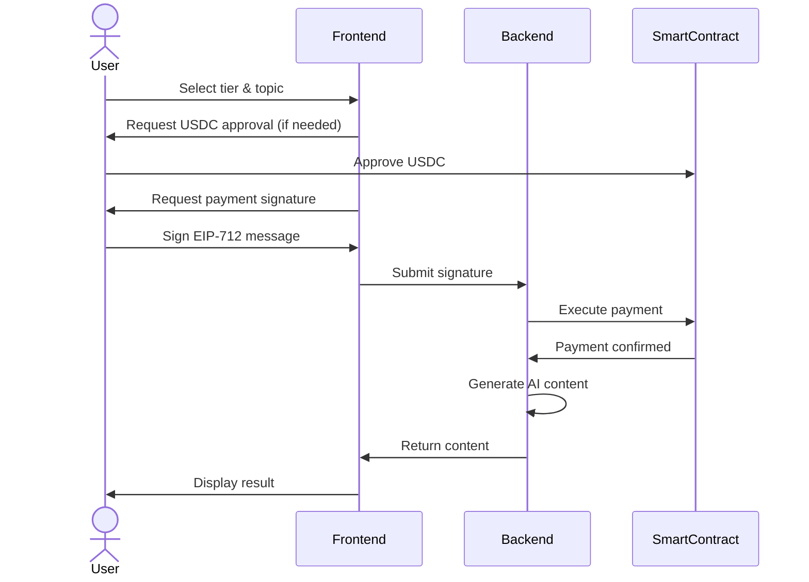

# Payment System Overview

BasedLink uses the X402 Payment Protocol for blockchain-based payment verification, enabling secure, signature-based payments for AI content generation.

## What is X402?

The X402 Payment Protocol is a blockchain payment system designed specifically for API monetization. Instead of users directly sending transactions, they sign authorization messages that a backend "facilitator" executes on their behalf.

### Key Benefits

- **Gasless for Users**: Users only pay for the service (USDC), not gas fees
- **Better UX**: Single signature instead of multiple transactions
- **Verifiable**: All payments recorded on-chain with full transparency
- **Flexible**: Supports both one-time and session-based payments

## Payment Flow

## Payment Methods

### Signature-Based Payments

The standard payment method using EIP-712 signatures:

1. User approves USDC spending (one-time)
2. User signs payment authorization (per generation)
3. Backend verifies and executes payment
4. Content is generated and returned

**Best for**: Individual content generation, occasional use

### Session-Based Payments

For power users generating multiple pieces of content:

1. User deposits USDC into contract
2. Backend deducts from session balance without signatures
3. User can withdraw remaining balance anytime

**Best for**: Bulk generation, frequent users, better UX

## Pricing Tiers

BasedLink offers three pricing tiers:

| Tier | Price | AI Model | Use Case |
|------|-------|----------|----------|
| Basic | Rp. 5 | llama-3.1-8b-instant | Quick posts |
| Pro | Rp. 15 | llama-3.3-70b-versatile | Professional content |
| Premium | Rp. 30 | llama-3.3-70b-versatile | Premium, research-heavy |

See [Pricing Tiers](../smart-contracts/pricing.md) for detailed comparison.

## Security Features

### EIP-712 Signatures

All payment authorizations use EIP-712 typed signatures:
- **Human-Readable**: Users see exactly what they're signing
- **Domain-Separated**: Signatures only valid for specific contract
- **Type-Safe**: Structured data prevents errors

### Replay Protection

Multiple layers prevent signature reuse:
- **Nonces**: Incrementing counter per user
- **Deadlines**: Time-bounded signatures (typically 1 hour)
- **ContentId**: One-time use identifiers

### On-Chain Verification

All payments verified on-chain:
- Signature authenticity checked by smart contract
- No off-chain trust required
- Full audit trail via blockchain events

## Payment Components

### Smart Contract (X402PaymentProcessor)

The on-chain component that:
- Verifies EIP-712 signatures
- Executes USDC transfers
- Tracks nonces and contentIds
- Manages session balances
- Emits payment events

### Backend Facilitator

The API service that:
- Provides nonces to frontend
- Receives payment signatures
- Executes payments on-chain
- Generates AI content after payment
- Returns results to frontend

### Frontend

The user interface that:
- Manages USDC approvals
- Generates EIP-712 signatures
- Submits payments to backend
- Displays generated content

## Integration Points

For detailed integration guides:

- **Frontend Developers**: [Payment Flow Details](../architecture/payment-flow.md)
- **Backend Developers**: [Payment Integration Guide](./payment-integration.md)
- **Smart Contract**: [API Reference](../smart-contracts/api-reference.md)

## Next Steps

- Learn about [Payment Flow Architecture](../architecture/payment-flow.md)
- Understand [EIP-712 Signatures](../smart-contracts/eip712-signatures.md)
- See [Frontend Integration](./frontend-integration.md) guide
