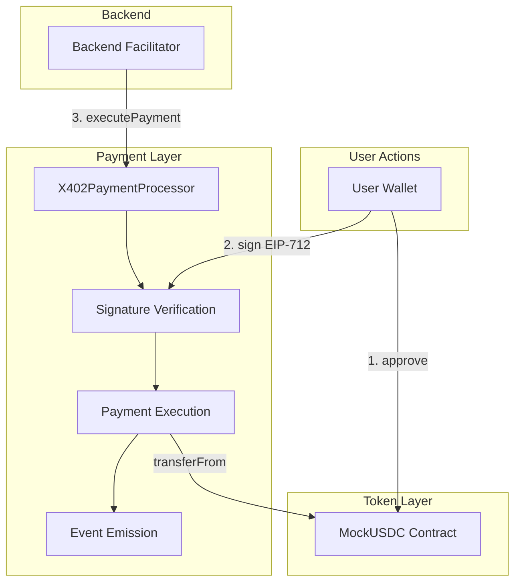

# Smart Contracts Overview

BasedLink uses two primary smart contracts deployed on Base Sepolia testnet to handle payment processing and token management.

## Contracts

### X402PaymentProcessor

The core payment processing contract that implements the X402 Payment Protocol for API monetization.

**Address (Base Sepolia)**: [View on BaseScan](https://sepolia.basescan.org/)

**Key Features:**
- EIP-712 signature verification for payment authorization
- Three-tier pricing model (Basic, Pro, Premium)
- Nonce management to prevent replay attacks
- ContentId uniqueness tracking
- Session-based payment support
- Event emission for payment tracking

### MockUSDC

An ERC20 token contract used for testnet payments.

**Address (Base Sepolia)**: [View on BaseScan](https://sepolia.basescan.org/)

**Key Features:**
- Standard ERC20 implementation
- Faucet function for testnet users
- 6 decimal places (standard for USDC)
- Free minting for testing purposes

## Contract Architecture



## Deployment Information

### Base Sepolia Testnet

**Network Details:**
- Chain ID: 84532
- Network Name: Base Sepolia
- RPC URL: `https://sepolia.base.org`
- Block Explorer: `https://sepolia.basescan.org`

**Contract Addresses:**

These addresses should be updated with actual deployment addresses:

```typescript
const CONTRACTS = {
  X402PaymentProcessor: '0x...', // Update after deployment
  MockUSDC: '0x...', // Update after deployment
};

const CHAIN_ID = 84532; // Base Sepolia
```

## EIP-712 Domain Separator

For generating valid signatures, use the following domain configuration:

```typescript
const domain = {
  name: "X402PaymentProcessor",
  version: "1",
  chainId: 84532,
  verifyingContract: CONTRACTS.X402PaymentProcessor,
};
```

## Pricing Tiers

The payment processor supports three pricing tiers:

| Tier | Name | Price (USDC) | Typical Use Case |
|------|------|--------------|------------------|
| 1 | Basic | 5.00 | Quick content generation, fast AI model |
| 2 | Pro | 15.00 | High-quality content, research-enhanced |
| 3 | Premium | 30.00 | Premium content, deep research, best quality |

**Note**: Prices are in USDC with 6 decimals (5.00 USDC = 5000000 in contract)

## Key Concepts

### Nonces

Each user has a nonce that increments with every successful payment. This prevents replay attacks.

**Reading a user's nonce:**
```solidity
function getUserNonce(address user) external view returns (uint256)
```

**Implementation:**
- Nonces start at 0
- Increment by 1 on each successful payment
- Must match current nonce in signature
- Prevents old signatures from being reused

### ContentId Uniqueness

Each `contentId` can only be used once across all users and tiers.

**Checking if a contentId is used:**
```solidity
function isContentIdUsed(string calldata contentId) external view returns (bool)
```

**Requirements:**
- Maximum length: 64 characters
- Must be unique across the platform
- Recommended format: `linkedin-{timestamp}-{randomId}`

### Deadlines

All payment signatures include a deadline timestamp.

**Purpose:**
- Limit signature validity period
- Prevent indefinite signature reuse
- Typical deadline: current timestamp + 1 hour

**Validation:**
```solidity
require(block.timestamp <= deadline, "Signature expired");
```

## Session Payments

For users who want to generate multiple pieces of content, session payments offer a better UX.

### How Session Payments Work

1. User deposits USDC into contract
2. Backend deducts from session balance without signatures
3. User withdraws remaining balance when done

### Session Functions

```solidity
// Deposit USDC for session
function deposit(uint256 amount) external

// Withdraw from session balance
function withdraw(uint256 amount) external

// Check session balance
function sessionBalance(address user) external view returns (uint256)

// Backend executes session payment
function executeSessionPayment(
    address user,
    uint256 tier,
    string calldata contentId
) external onlyFacilitator
```

## Events

The contract emits events for tracking payments:

### PaymentExecuted

Emitted when a signature-based payment is successfully executed.

```solidity
event PaymentExecuted(
    address indexed user,
    uint256 indexed tier,
    string contentId,
    uint256 price
);
```

### SessionDeposit

Emitted when a user deposits USDC for session payments.

```solidity
event SessionDeposit(
    address indexed user,
    uint256 amount
);
```

### SessionPaymentExecuted

Emitted when a session payment is executed.

```solidity
event SessionPaymentExecuted(
    address indexed user,
    uint256 indexed tier,
    string contentId,
    uint256 price
);
```

### SessionWithdrawal

Emitted when a user withdraws from their session balance.

```solidity
event SessionWithdrawal(
    address indexed user,
    uint256 amount
);
```

## Access Control

### Facilitator Role

The backend service operates as the "facilitator" with special permissions:

**Permissions:**
- Execute payments using user signatures
- Execute session payments
- Cannot withdraw funds (security feature)

**Setting the facilitator:**
```solidity
function setFacilitator(address _facilitator) external onlyOwner
```

### Owner Role

The contract owner can:
- Update facilitator address
- Update pricing tiers
- Withdraw accumulated fees
- Pause/unpause contract (emergency)

## Security Features

### Signature Verification

All signatures are verified on-chain using EIP-712 encoding:

```solidity
bytes32 structHash = keccak256(
    abi.encode(
        PAYMENT_REQUEST_TYPEHASH,
        user,
        tier,
        keccak256(bytes(contentId)),
        nonce,
        deadline
    )
);

bytes32 digest = _hashTypedDataV4(structHash);
address signer = ECDSA.recover(digest, signature);
require(signer == user, "Invalid signature");
```

### Replay Protection

Multiple mechanisms prevent replay attacks:
- **Nonces**: Monotonically increasing per user
- **ContentId**: One-time use only
- **Deadlines**: Time-bound signatures
- **Domain Separator**: Chain and contract specific

### Reentrancy Protection

All state-modifying functions use the `nonReentrant` modifier from OpenZeppelin.

## Gas Optimization

The contracts are optimized for gas efficiency:

- **Minimal Storage**: Only essential data stored
- **Packed Storage**: Efficient struct packing
- **View Functions**: Free nonce and price queries
- **Event Indexing**: Optimized event parameters

## Upgradeability

**Current Status**: Non-upgradeable

The contracts are deployed without proxy patterns for simplicity and security. Any changes require new contract deployment and migration.

**Future Considerations:**
- UUPS proxy pattern for upgradeability
- Migration scripts for user session balances
- Backward compatibility for existing signatures

## Testing

Comprehensive test coverage includes:

- Signature verification tests
- Payment execution tests
- Nonce management tests
- Session payment tests
- Access control tests
- Edge case handling

**Run tests:**
```bash
cd SmartContract
forge test
```

## Next Steps

- [API Reference](./api-reference.md) - Detailed function documentation
- [Pricing](./pricing.md) - Pricing tier details
- [EIP-712 Signatures](./eip712-signatures.md) - Signature implementation guide
- [Deployment Guide](./deployment.md) - Deploy your own instance
